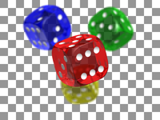
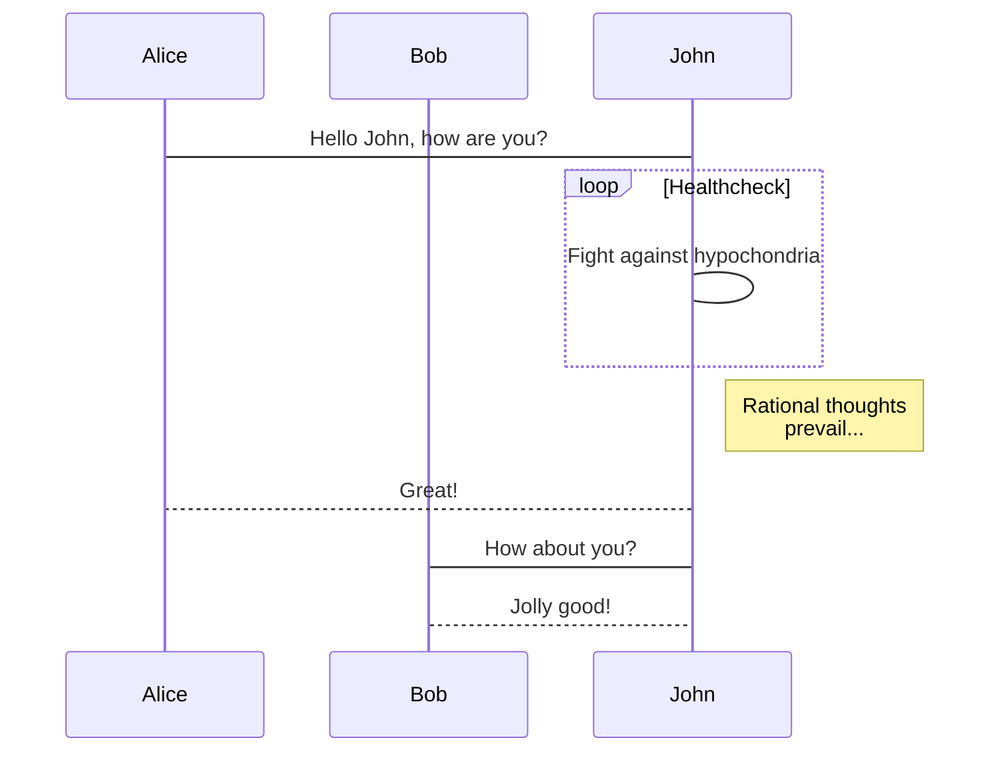
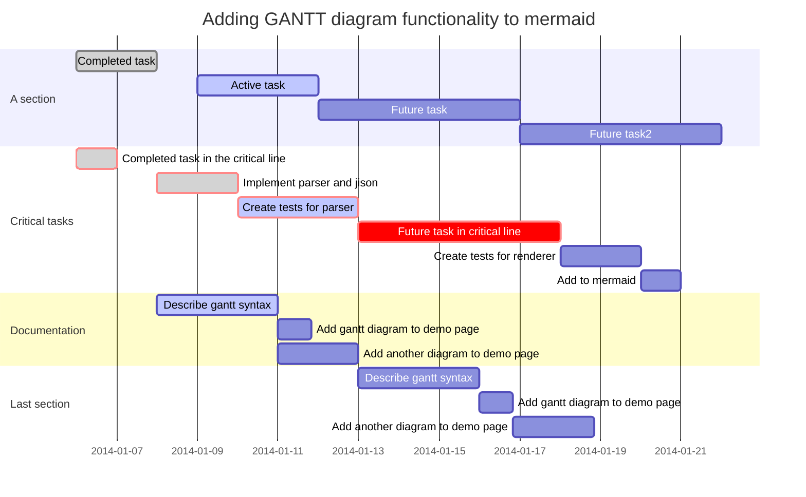
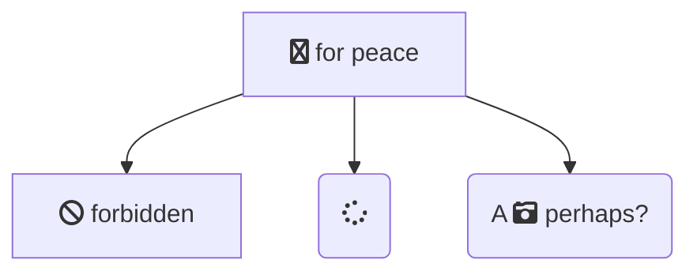
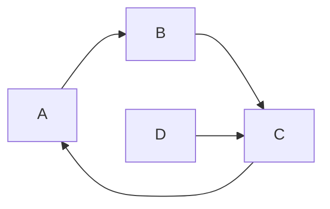
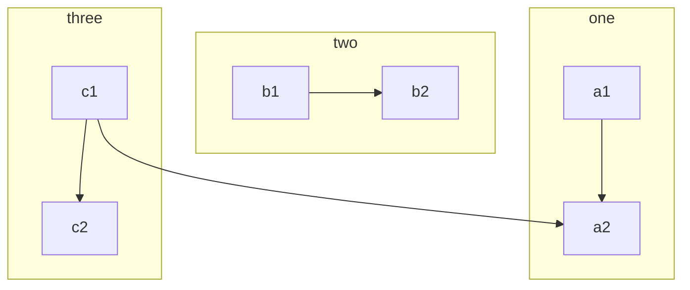
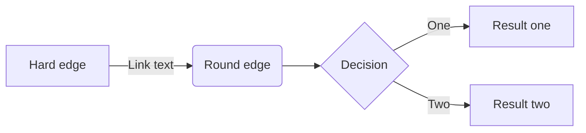
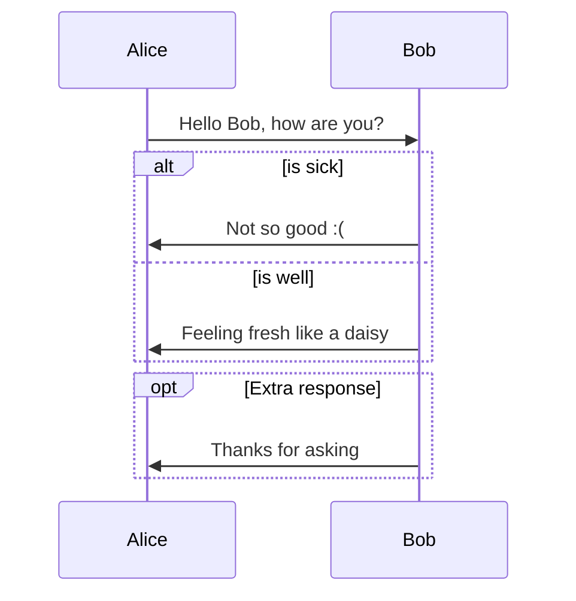
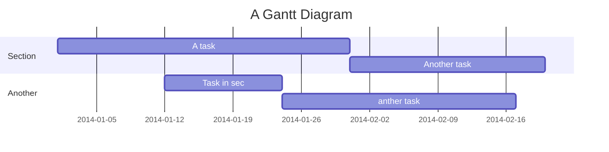

# foo

this is a markdown file
with a code block

## Image



## Table

| テーブル   | ヘッダ |
| ---------- | ------ |
| コンテンツ | ウェー |

## Programming Code

### Block

```js
#!/usr/bin/env node
'use strict';

var pdc = require('pandoc-filter');

function mermaid(typ, val) {
  if (typ !== 'CodeBlock') {
    return null;
  }

  var cls = val[0][1];
  if (0 > cls.indexOf('mermaid')) {
    return null;
  }

  var cnt = val[1];
  return pdc.Div(
    ['', [], []],
    [
      pdc.RawBlock('html', '<!-- htmlmin:ignore -->'),
      pdc.Div(['', ['mermaid'], []], [pdc.Plain([pdc.Str(cnt)])]),
      pdc.RawBlock('html', '<!-- htmlmin:ignore -->'),
    ],
  );
}

pdc.toJSONFilter(mermaid);
```

```html
<div>
  <!-- htmlmin:ignore -->
  <div class="mermaid">graph TD; A--&gt;B; A--&gt;C; B--&gt;D; C--&gt;D;</div>
  <!-- htmlmin:ignore -->
</div>

<link rel="stylesheet" href="css/mermaid.min.css" />
<script src="js/mermaid.min.js"></script>
<script>
  mermaid.initialize({ startOnLoad: true });
</script>
```

```javascript
import {x, y} as p from 'point';
const ANSWER = 42;

class Car extends Vehicle {
  constructor(speed, cost) {
    super(speed);

    var c = Symbol('cost');
    this[c] = cost;

    this.intro = `This is a car runs at
      ${speed}.`;
  }
}

for (let num of [1, 2, 3]) {
  console.log(num + 0b111110111);
}

function $initHighlight(block, flags) {
  try {
    if (block.className.search(/\bno\-highlight\b/) != -1)
      return processBlock(block.function, true, 0x0F) + ' class=""';
  } catch (e) {
    /* handle exception */
    var e4x =
        <div>Example
            <p>1234</p></div>;
  }
  for (var i = 0 / 2; i < classes.length; i++) { // "0 / 2" should not be parsed as regexp
    if (checkCondition(classes[i]) === undefined)
      return /\d+[\s/]/g;
  }
  console.log(Array.every(classes, Boolean));
}

export  $initHighlight;
```

### Inline

`<$>`{.haskell}

`std::printf("%s\n", "Hello, World!");`{.cpp}

## mermaid

### Flow


### sequence



### Gantt



# Other

## Font Awesome












